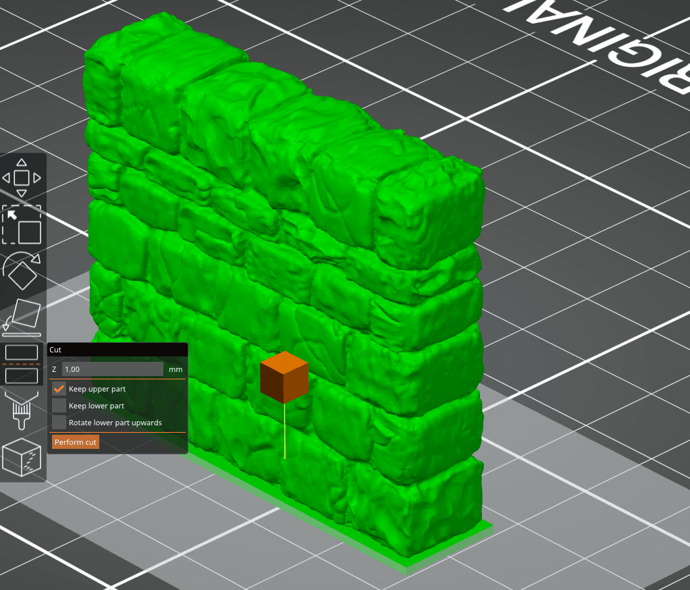
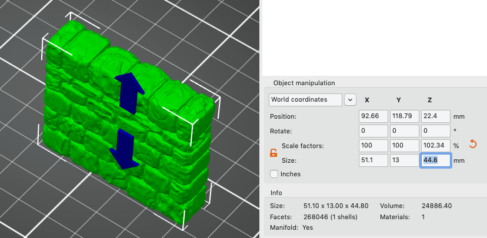

OpenForge 2.0 Community Dungeon Stone Separate Wall Bases
=========================================================

Separate wall tiles for OpenForge external Dungeon Stone walls.

     

     

## Seamless Wall Hint

If you want to have a seamless separate wall without the plain seam between the base and the wall you can prepare your OpenForge wall like so:

1. cut the bottom 1 mm from the wall with your slicer

     

2. scale the z size (i.e. the height) of your wall and make it 1 mm higher

     

## Printing Notes

Test-printed with the following settings on a "Prusa Mini":

- slicer: PrusaSlicer (Slic3r)
- filament: PLA
- nozzle: 0.4 mm 
- layer height: 0.10 or 0.15 mm
- infill: 10%
- supports: not necessary

## Future

More wall sizes are planned...

## Credits

Based on and remixed from:
https://www.thingiverse.com/thing:2787903

## License

 OpenVLex 2 is licensed under a <a rel="license" href="http://creativecommons.org/licenses/by-sa/4.0/">Creative Commons Attribution-ShareAlike 4.0 International License</a>.

## Version History

#### 2021-04-21 v1.4.0

  - added D.triplex base variants

#### 2021-04-18 v1.3.0

  - added A.triplex base variants

#### 2021-04-18 v1.2.0

  - added A.triplex base

#### 2021-03-28 v1.1.0

  - added XA.triplex base

#### 2021-02-28 v1.0.0

  - initial version
